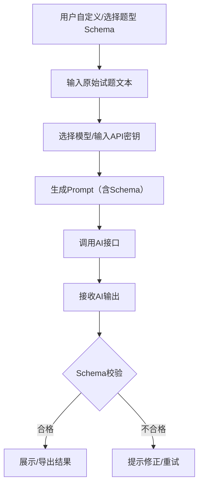

# 试题推土机 🚜

一键将非标准格式的选择题转换为结构化JSON并导出Excel，支持自定义题型和AI模型。

## 快速开始

```bash
pip install -r requirements.txt
streamlit run app.py
```

## 主要功能
- 多题型支持（单选、多选、判断等）
- 多AI模型选择
- 自定义导出格式
- 题型管理与Schema自定义
- 批量处理与Excel导出

## 配置
- 请参考 `config.example.json`，将其复制为 `config.json` 并填写API密钥等信息。

## 安全提示
- 请勿上传真实API密钥和隐私数据到GitHub。

## 功能特点

- 支持多种题型（单选题、多选题、判断题等）
- 支持多个AI模型（DeepSeek、Qwen）
- 自定义导出格式
- 批量处理支持
- 友好的Web界面

## 支持的模型

### DeepSeek
- deepseek-chat (4000 tokens)：适用于一般对话和简单试题转换
- deepseek-coder (4000 tokens)：专注于代码相关的试题转换

### Qwen
- qwen-turbo (2000 tokens)：快速响应，适合简单试题
- qwen-plus (4000 tokens)：平衡速度和质量，适合一般试题
- qwen-max (6000 tokens)：最高质量，适合复杂试题

## 安装说明

1. 克隆仓库：
```bash
git clone https://github.com/yourusername/question-converter.git
cd question-converter
```

2. 安装依赖：
```bash
pip install -r requirements.txt
```

3. 运行应用：
```bash
streamlit run app.py
```

## 使用说明

1. 在侧边栏选择模型类型和具体模型
2. 输入对应的API密钥
3. 选择要处理的题型
4. 在主界面输入试题文本
5. 点击"开始处理"按钮
6. 查看JSON格式的处理结果
7. 点击"导出到Excel"保存结果

## 目录结构

```
.
├── app.py              # 主程序入口
├── config_manager.py   # 配置管理模块
├── schema_manager.py   # Schema管理模块
├── json_processor.py   # JSON处理模块
├── excel_exporter.py   # Excel导出模块
├── api_caller.py       # API调用模块
├── requirements.txt    # 项目依赖
└── README.md          # 项目说明
```

## 开发说明

- 使用Python 3.8+
- 遵循PEP 8编码规范
- 使用类型注解
- 完善的错误处理
- 模块化设计

## 注意事项

1. API密钥安全：
   - 不要在代码中硬编码API密钥
   - 使用环境变量或配置文件存储API密钥
   - 定期更换API密钥

2. 数据处理：
   - 输入文本不要过长，注意模型的token限制
   - 批量处理时注意数据量
   - 导出文件会自动保存在exports目录

3. 错误处理：
   - 注意查看错误提示
   - 如果转换失败，可以尝试其他模型
   - 保持网络连接稳定

## 贡献指南

1. Fork 项目
2. 创建功能分支
3. 提交更改
4. 推送到分支
5. 创建 Pull Request

## 许可证

MIT License 

## 工作步骤与流程

### 1. 用户操作流程

1. **题型管理**
   - 用户在"题型管理"页面自定义或编辑题型的 Schema（结构定义）和提示词（Prompt）。
   - 系统保存题型配置，供后续选择和调用。

2. **选择功能**
   - 用户在主页面选择"试题转换"或"题型管理"功能。

3. **设置参数**
   - 用户在侧边栏选择 AI 模型类型、具体模型、输入 API 密钥、选择题型。

4. **输入原始试题文本**
   - 用户在主页面输入待转换的原始题目文本。

5. **发起转换**
   - 用户点击"开始处理"按钮。

### 2. 系统处理流程

1. **加载题型 Schema**
   - 根据用户选择的题型，系统加载对应的 Schema 和提示词。

2. **生成 Prompt**
   - 系统将 Schema 和提示词拼接，生成完整的 AI 指令（Prompt）。

3. **调用 AI 接口**
   - 系统用 API 密钥调用大模型（如 deepseek、qwen），发送 Prompt 和题目文本。

4. **接收 AI 输出**
   - 系统接收 AI 返回的 JSON 格式结构化数据。

5. **Schema 校验**
   - 系统用 Schema 校验 AI 输出的 JSON，检查字段、类型、必填项等。

6. **错误处理**
   - 若校验失败，系统提示用户修正或重试。
   - 若校验通过，进入下一步。

7. **结果展示与导出**
   - 系统在页面展示结构化 JSON 数据。
   - 用户可一键导出为 Excel 文件。

### 3. 简明流程图



--- 